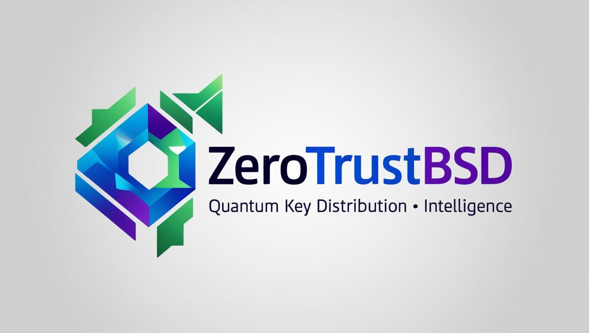

# 🛡️ ZeroTrustBSD Autonomous Cyber Defense OS

## The Sovereign Security Operating System. 

**Engineered for Nation-Scale Defense, Tactical Autonomy, and Critical Infrastructure Resilience.**

In an age where cyber threats evolve faster than our ability to defend, **ZeroTrustBSD** stands as a beacon of digital sovereignty and tactical resilience.

Built on hardened OpenBSD and engineered for defense, critical infrastructure, and regulated industry.

ZeroTrustBSD is a sovereign cybersecurity operating system delivering native Zero Trust Architecture (ZTA) capabilities. Built upon OpenBSD, it integrates post-quantum encryption, policy automation, and military-grade networking to ensure security at every layer.

It is designed to meet the highest levels of regulatory and operational compliance across Europe and NATO-aligned organizations.

**ZeroTrustBSD** is more than just a firewall, it is a fully integrated, **Autonomous Cyber Defense OS**, built from the ground up on the rock-solid foundation of **OpenBSD**. 

This platform was designed for those who demand absolute control, security, and scalability in the most hostile environments.

Whether you’re securing the borders of a sovereign nation, protecting critical industrial infrastructure, or operating in the unforgiving fields of modern warfare, **ZeroTrustBSD** equips you with the tools to not just react, but **proactively defend**. 

The heart of its design is **Zero Trust**, enforcing strict **identity-based segmentation**, rigorous **compliance automation**, and state-of-the-art **microsegmentation** to ensure that no malicious actor ever moves laterally within your network.

Think of **ZeroTrustBSD** as your **first line of defense**, an open-source fortress that’s as tough as the mission it was designed for. Fully autonomous, highly secure, and adaptable, it scales from the **smallest edge deployment** to the most **complex, multi-tiered infrastructure**.

Get ready to step into the future of network security, where your firewall isn’t just an appliance, but the **central command layer** of a truly resilient, self-healing, and sovereign digital ecosystem.

> _Built on [OpenBSD](https://www.openbsd.org/). Born for Zero Trust. Designed to be military grade, disaster recovery ready, resilient and nimble in many use cases._  
> “You don’t buy sovereignty. You build it — with **ZeroTrustBSD**.”
---

## 🚀 Overview

**ZeroTrustBSD** is an **Autonomous Cyber Defense OS** ; a digitally sovereign, open-source security platform built on OpenBSD. 

It transforms any appliance into a programmable network shield capable of:
- **Microsegmentation** with VXLAN (Virtual Extended Local Access Network), PF (OpenBSD Packet Filter), and anchors and more.
- **BGP-driven overlays** for interconnectivity and failover for telecom applications 
- **Signed configuration enforcement** via [Signify](https://man.openbsd.org/signify)
- **Embedded compliance** automation for critical industries

Ideal for:
- Government & national defense networks
- Industrial and OT segmentation (IEC 62443, NIS2)
- Embassy, field, and disaster-resilient deployments
- Secure sovereign edge and cloud zones
- Central Banks and Financial Instituions

## 🌍 Global Deployment Readiness

ZeroTrustBSD is engineered not only for resilience; but also for international interoperability, regulatory alignment, and sovereign-scale adoption. 

It is suitable for deployment in:

- 🇪🇺 European NIS2-compliant networks
- 🇦🇪 UAE smart infrastructure and OT systems
- 🌍 African Union sovereign data programs (AfCFTA-aligned)
- 🇮🇳 Indo-Pacific Zero Trust edge deployments
- 🛰 Defense enclaves under NATO STANAG and ISO 27001

---

## 🔐 Core Security Architecture

- 🧬 Hardened [OpenBSD](https://www.openbsd.org/) kernel with **pledge(2)**, **unveil(2)**, **W^X**, and securelevel
- 🔏 Immutable, signed configs using [Signify](https://man.openbsd.org/signify)
- 🔐 MFA + identity-based access using [RCDevs OpenOTP](https://www.rcdevs.com/) or compatible IAM suites like [PrivacyIDEA](https://www.privacyidea.org/), [Keycloak](https://www.keycloak.org/), [Authentik](https://goauthentik.io/), and [Authelia](https://www.authelia.com/)
- 📜 GitOps & file integrity via `rc.firstboot`, `sha256`, and git-tracked `/etc`

---

## 🧩 Key Features

- Zero Trust Microsegmentation – Identity-aware access control across VLANs, VXLANs, MPLS domains
- Post-Quantum Ready – Integration with QKD, PQC algorithms, and fiber WDM support
- CISO Assistant – AI-driven compliance, audit readiness, and risk telemetry
- OpenCTI Integration – Live threat intel enrichment and adversary mapping
- SATCOM & SD-RAN – Tactical network mobility support with defense compatibility
- Regulatory Compliance Built-In – Automates controls for GDPR, NIS2, DORA, ISO27001
- Military-Grade Encryption – Hardened cryptographic stack and full-stack observability

--- 

## 🛡 FreeIPA Integration for Advanced Identity & Access Management

**ZeroTrustBSD** is enhanced with **FreeIPA**, bringing robust, centralized **identity management** and **access control** to the forefront. **FreeIPA** integrates seamlessly, offering powerful capabilities to secure your network infrastructure and ensure compliance with the highest standards.

Here’s how **ZeroTrustBSD** with **FreeIPA** makes securing your digital ecosystem easy and effective:

- **Centralized Authentication**: Manage users and devices with ease using **FreeIPA’s** LDAP, ensuring a unified identity store for your entire organization. By integrating **ZeroTrustBSD**, you can control access across all your network devices with **granular security policies**.

- **Kerberos-Based Security**: **ZeroTrustBSD** benefits from **FreeIPA’s** **Kerberos** authentication to provide **high-assurance, single sign-on (SSO)** capabilities.

Secure authentication is ensured across all devices and services in your network, reducing the risk of unauthorized access.

- **Multi-Factor Authentication (MFA)**: With **FreeIPA**’s MFA support, you can take security to the next level by enforcing **two-factor authentication** for every user. Whether it’s **TOTP** (Time-based One-Time Password) or integrating **OpenOTP**, **ZeroTrustBSD** makes MFA easy and efficient.

- **Role-Based Access Control (RBAC)**: Empower your security team with **FreeIPA’s** **RBAC**, which allows you to set strict access controls based on **user roles**. **ZeroTrustBSD** takes it further by enforcing these roles at the **network layer**, ensuring that each user’s access is in line with your security policies.

- **Host-Based Access Control**: FreeIPA’s host-based access control allows **ZeroTrustBSD** to enforce device-specific security policies, ensuring that only **trusted, compliant devices** are allowed to communicate within your secure network.

- **Audit Logging for Compliance**: Gain visibility into who is accessing what and when. With **FreeIPA’s** detailed **audit logging** integrated into **ZeroTrustBSD**, you can ensure full accountability and streamline compliance with regulations like **GDPR**, **HIPAA**, or **PCI-DSS**.

---

## ☁️ Multi-Cloud & Private Cloud Integration

In today’s world, enterprises are rapidly adopting **multi-cloud** and **hybrid-cloud** strategies to take advantage of the best features of both public and private clouds. **ZeroTrustBSD** is built to thrive in these environments, ensuring **consistent security**, **identity management**, and **access control** across all cloud platforms. 

Whether you’re leveraging **VMware** for your private cloud infrastructure or deploying **OpenStack** in a multi-cloud configuration, **ZeroTrustBSD** provides seamless integration:

### **VMware Integration**
- **Microsegmentation** with **VMware NSX** for full network isolation.
- **Automated policy enforcement** via **vRealize Automation**.
- **Kerberos-based Authentication** and **MFA** with **VMware Identity Manager**.

### **OpenStack Integration**
- **VXLAN Segmentation** using **OpenStack Neutron**.
- **Identity Management** via **OpenStack Keystone** with **MFA** and **Zero Trust** policies.
- **Compliance Automation** with integrated audit logging and observability.

### **Multi-Cloud Connectivity**
- **BGP-driven overlays** between **ZeroTrustBSD** and multiple cloud providers; not forgetting GIXs.
- **Identity Federation** across **AWS**, **Azure**, and **Google Cloud** IAM systems.
- **Cloud-native observability** through **Prometheus** and **Grafana**.

---

## 🛰️ Tactical Networking & Microsegmentation

- 🌐 Layer-2 VXLAN overlays with segment-specific firewall rules
- 🔄 Dynamic route orchestration with [OpenBGPD](https://man.openbsd.org/bgpd)
- 🧱 High availability with [CARP](https://man.openbsd.org/carp)
- 🏭 Purdue Model isolation with jails, loopbacks, and anchored rulesets

Detailed architecture playbooks are in [`MICROSEGMENTATION.md`](MICROSEGMENTATION.md).

---

## 🛡 Threat Detection + Observability Suite

- 🕵️ [Suricata](https://suricata.io/) for inline IDS/IPS + threat feeds
- 📡 [Zeek](https://zeek.org/) for passive network telemetry and anomaly detection
- 🔐 [Wazuh](https://wazuh.com/) for log monitoring, SIEM, FIM, and compliance mapping
- 📊 [Prometheus](https://prometheus.io/), [Filebeat](https://www.elastic.co/beats/filebeat), [Grafana](https://grafana.com/), and ELK for full-stack observability

### 🧠 **Threat Intelligence Integration: [OpenCTI](https://www.opencti.io/)**
- Seamless integration with **OpenCTI** for centralized threat intelligence management
- Aggregates and correlates CTI data from multiple sources (OSINT, commercial, and internal)
- Allows sharing, collaboration, and alerting on actionable threats

# 🔍 **Passive R-SPAN Monitoring**

## SPAN and RSPAN – A Non-Technical Overview

### 🔍 Think of it like surveillance in a building:

You have a secure building with many rooms (your network). Each room represents a device or a user. Most of the time, what’s happening inside each room is hidden.

But what if you want to **monitor** what’s going on—without disturbing or exposing anything?

That’s what **SPAN** and **RSPAN** are for. They’re **digital security cameras** for your network.

---

### 📡 SPAN (Switched Port Analyzer)

- **What it does**: Makes a copy of all the digital traffic (like emails, files, apps) going in and out of a certain port (or “room”).
- **Where it sends it**: To a monitoring system like a cybersecurity tool (SIEM, IDS, etc.).

🧠 *Think of it as placing a camera right at the door of a room to watch who goes in or out—without blocking them.*

---

### 🌐 RSPAN (Remote SPAN)

- **What it does**: Same as SPAN—but it lets you watch traffic happening in another building (or another part of your network).
- **Where it sends it**: The copied traffic is sent **across the network** to a remote location for analysis.

🧠 *It’s like sending a live camera feed to a command center in another city.*

---

### 🤝 Why SPAN & RSPAN Matter

| Benefit                      | Explanation |
|-----------------------------|-------------|
| **Incident Response**       | Security teams can “see” what happened during or after a breach. |
| **Compliance & Auditing**   | Regulators often require activity logging—SPAN helps create this trail. |
| **Threat Detection**        | SPAN lets AI or human analysts catch suspicious patterns in real time. |
| **Zero Trust Forensics**    | In systems like ZeroTrustBSD, SPAN helps prove policy enforcement is working. |

---

### 🔐 SPAN in ZeroTrustBSD

In the context of ZeroTrustBSD, **SPAN** is tightly integrated with **microsegmentation** and **threat detection**. Each “camera” is placed with precision—only watching what’s necessary, and always under cryptographic policy.

It’s not about surveillance. It’s about **resilience**, **evidence**, and **control**.

### 📊 **CMDB + Asset Management**
- **Optional ITIL-based CMDB** integrated with ZeroTrustBSD for IT asset management and lifecycle tracking
- Supports automated discovery, classification, and inventory of network assets
- Enhances compliance by automatically mapping devices, users, and access to specific security policies

---

## 🔒 Next-Gen Cryptography & VPN

- 🔑 [WireGuard](https://www.wireguard.com/) for high-speed secure tunnels
- 🛡️ IPsec + [OpenVPN](https://openvpn.net/) for broad compatibility
- 🔬 Quantum-safe readiness via crypto-agile abstraction

---

## 🖥 Remote Command Console (UI)

- React + [Grafana](https://grafana.com/) dashboard with real-time firewall status
- Display PF state, VXLAN topology, and live threat events
- Trigger lockdown, config reloads, BGP resets
- Lightweight and deployable in both cloud and air-gapped environments

# Compatible EDR and Access Control Models for OpenBSD-Based Systems

## 🛡️ Open Source EDR Tools (OpenBSD-Compatible or Adaptable)

| Tool        | Capabilities                                                | OpenBSD Compatibility                      |
|-------------|-------------------------------------------------------------|--------------------------------------------|
| **Wazuh**   | File integrity monitoring, rootkit detection, syslog audit  | Compatible via syslog agent; BSD packaging |
| **OSSEC**   | Host intrusion detection, log monitoring                    | Compatible; native BSD support             |
| **Velociraptor** | Endpoint DFIR, live queries, YARA support            | Can be containerized or used remotely      |
| **R-SYSLOG + YARA** | Log aggregation + rule-based matching             | Fully supported on OpenBSD                 |
| **Snort/Suricata** | Network-based detection (IDS/IPS)                   | Runs well on OpenBSD for network EDR       |

> Note: Full endpoint telemetry like kernel module introspection is limited on OpenBSD for stability and security reasons. However, agentless and syscall-level logging via `syslogd`, `ktrace`, and `eBPF` (future scope) are supported.

---

## 🔐 Access Control Models Beyond RBAC (OpenBSD-Aware)

| Model         | Description                                                                 | OpenBSD Compatibility |
|---------------|-----------------------------------------------------------------------------|------------------------|
| **MAC (Securelevel + Pledge/Unveil)** | OpenBSD-native. Controls access to kernel features and syscall scopes.  | Native                |
| **ABAC (via LDAP + PF + Certs)**      | Attribute-based rules using FreeIPA/OpenLDAP with PF tagging/logging    | Supported             |
| **PBAC (Policy-Based using pf.conf + anchors)** | Define behavior declaratively through anchored firewall rules         | Native                |
| **Certificate/Key-based ACLs**        | Use `signify`, SSH certs, or TLS client auth to gate service access     | Fully supported       |
| **Capability-based IPC (pledge/capsicum)** | Control inter-process behavior using syscall limits and IPC boundaries | Supported (pledge)    |

> OpenBSD emphasizes **deterministic**, **auditable**, and **minimal-privilege** access. Models like ABAC and PBAC are best implemented at the network/policy layer rather than complex middleware.

---

## 🏢 Enterprise & Sector Use Cases

### 🛡 Government / Military
- National firewall infrastructure enforcing digital sovereignty
- Tactical battlefield deployments with dynamic BGP meshing and CARP failover
- Embassy and diplomatic zones with air-gap mode and identity-aware access
- Intelligence compartmentalization with VXLAN + identity + anchor rulesets

### ⚙️ Industrial (OT / ICS)
- Purdue Model enforcement for SCADA and PLC isolation
- IEC 62443, NIS2, and ISO 27001-compliant controls
- Secure remote access via WireGuard/IPsec for plant technicians

### 🏥 Healthcare
- Identity-isolated clinical VLANs (radiology, ER, admin)
- Encrypted patient data flows with anomaly detection
- Automated HIPAA policy validation via CISO toolkit

### 🏦 Financial & Fintech
- PCI-DSS segment isolation for cardholder data environments (CDE)
- Zero Trust access brokers for identity-based transaction security
- Real-time SIEM and breach visibility via Suricata/Zeek/Wazuh

### 🌐 Sovereign Cloud / Edge Computing
- Hyperlocalized, digitally sovereign enclaves
- Inter-cluster VXLAN overlays with GitOps-signed firewall policies
- Federated identity and compliance drift control

---

## 🌐 SD-WAN Integration

ZeroTrustBSD can integrate **SD-WAN** capabilities to create dynamic, secure connections across geographically distributed networks. Features include:
- **Dynamic Path Selection** for intelligent routing based on network conditions.
- **Traffic Encryption** for secure transmission across untrusted WAN connections.
- **Zero Trust Security** ensuring identity-based access to SD-WAN resources.
- **Centralized Policy Management** with ZeroTrustBSD’s unified control plane.

---

## 🛰️ SD-RAN (Software-Defined Radio Access Network) Integration for 4G, 5G, and Satellite Communications

With **SD-RAN** support, ZeroTrustBSD enables secure, scalable, and flexible mobile network management. Key features include:
- **Private 4G/5G networks**: Secure local deployment of mobile networks with advanced **network slicing**.
- **Radio Resource Management (RRM)** and **dynamic spectrum allocation**.
- **Edge Computing** for low-latency mobile services.
- **Seamless Roaming** for mobile devices across **private** and **public networks**.
- **Quantum-safe encryption** and **identity-based access** policies for mobile communications.

# 🔐 Quantum Key Distribution (QKD) vs Post-Quantum Cryptography (PQC)

## 🧬 What is Quantum Key Distribution (QKD)?

Quantum Key Distribution (QKD) is a method of distributing encryption keys using quantum particles—typically photons. Its security is based on the laws of quantum mechanics.

### 📡 How It Works:
1. Photons are transmitted with quantum states (e.g., polarization).
2. The receiver randomly measures the photons.
3. Both parties compare results and keep only matching basis values.
4. Any eavesdropping attempt introduces detectable anomalies.

### ✅ Pros:
- Based on physics, not math
- Eavesdropping is detectable (via Quantum Bit Error Rate)
- Immune to quantum computer attacks

### ❌ Cons:
- Requires expensive specialized equipment
- Works best over fiber or line-of-sight paths (≤100 km)
- Not practical for large-scale global deployment

📚 **References**:
- [QKD Overview – ID Quantique](https://www.idquantique.com/quantum-safe-security/quantum-key-distribution/)
- [BB84 Protocol – Springer](https://link.springer.com/article/10.1007/BF00191318)
- [ESA QKD Milestone](https://connectivity.esa.int/news/esa-project-achieves-spaceenabled-quantum-key-distribution-link-milestone)

---

## 🔐 What is Post-Quantum Cryptography (PQC)?

Post-Quantum Cryptography (PQC) consists of cryptographic algorithms that are secure against both classical and quantum computers, but do not require quantum technology.

### ⚙️ How It Works:
PQC algorithms rely on mathematically hard problems like lattice reduction, multivariate equations, and hash functions.

### 📊 Key Algorithms:
- **Kyber** (encryption)
- **Dilithium**, **FALCON**, **SPHINCS+** (signatures)
- **Classic McEliece**, **NTRU** (encryption)
- Standardized by **NIST** in 2022.

### ✅ Pros:
- Runs on classical hardware
- Internet-scalable and backward compatible
- Already in pilot deployment stages

### ❌ Cons:
- Larger key sizes and signature overhead
- Still under active evaluation
- May be slower in embedded environments

📚 **References**:
- [NIST PQC Project](https://csrc.nist.gov/projects/post-quantum-cryptography)
- [Kyber/Dilithium – CRYSTALS Project](https://pq-crystals.org/)
- [Cloudflare PQC Blog](https://blog.cloudflare.com/post-quantum-for-all/)

---

## ⚖️ QKD vs. PQC Comparison Table

| Feature               | QKD                          | PQC                           |
|-----------------------|------------------------------|--------------------------------|
| Based on Physics      | ✅ Yes                        | ❌ No (math-based)             |
| Needs Special Hardware| ✅ Yes (QKD devices)          | ❌ No                          |
| Internet-Scalable     | ❌ No                         | ✅ Yes                         |
| Immune to Quantum     | ✅ Yes                        | ✅ Yes                         |
| Detects Eavesdropping | ✅ Yes                        | ❌ No                          |
| Used in TLS           | ❌ Not yet                    | ✅ Kyber & Dilithium (in trials) |

---

## 🧠 Thoughts?

Both QKD and PQC aim to secure communications against the threat of quantum computing, but approach it differently:

- QKD = Use light and quantum states to share keys securely.
- PQC = Use post-quantum algorithms to replace RSA/ECC across digital systems.

A **hybrid model** may offer the best defense; QKD for high-assurance key distribution, and PQC for global digital infrastructure.

---

## 📍 Roadmap: What’s Coming

- **Live GitOps Pull Mode** with commit signature enforcement  
- **Offline Key Vault Agent** for secure key management  
- **ZFS Snapshot & Rollback** for immutable, recoverable states  
- **Signify-based Remote Update Server** with tamper-proof policy pushes  
- **Mobile 5G Cell Deployment** stack via OpenAirInterface + SDR  
- **OpenTelemetry** for structured trace ingestion  
- **Mermaid.js** embedded architecture visualizer in the console  
- **AI-driven Anomaly Scoring** and automated drift alerts  
- **VMware vSphere & NSX** native policy enforcement  
- **Advanced OpenStack** private cloud security integration  
- **Multi-Cloud Identity Federation** (AWS, Azure, Google Cloud)  
- **Kubernetes Orchestration** support across hybrid platforms  

---

## 💡 Why “Autonomous Cyber Defense OS”?

- Installs & secures itself in air-gapped or hostile networks
- Operates independently with built-in detection and policy enforcement
- Unifies firewall, router, observability, and compliance layers under one OS
- Powered by open protocols, hardened by BSD discipline

> ZeroTrustBSD is not an appliance. It is an operator-grade control system — programmable, observable, sovereign.

---


# 🧠 Artificial Intelligence Integration for ZeroTrustBSD

ZeroTrustBSD is designed to leverage **open, auditable artificial intelligence models** for both cybersecurity enforcement and operational augmentation. This includes, but is not limited to, integration with locally hosted or containerized LLMs (e.g., LLaMA, Falcon, Mistral, GPT-J) and AI APIs deployed in secure gateways.

**Sovereign systems + Quantum security + Smart AI = Cyber resilience 2.0**

This guide explores how AI can elevate the security operations of a ZeroTrustBSD-based infrastructure, especially in environments adopting Quantum Key Distribution (QKD), strict policy enforcement, and threat intelligence frameworks.

---

## 📌 Use Cases for AI in Cybersecurity

| 🛡️ Use Case | 🔍 Description |
|------------|----------------|
| **Threat Intelligence** | Summarize threat feeds, malware reports, or vulnerability CVEs using AI models. |
| **CISO Assistant** | Create a command-line advisor that helps interpret compliance rules, guides PF rule syntax, or explains identity architecture. |
| **SIEM Triage** | Process and prioritize Wazuh, ELK, or journald alerts. AI can identify high-risk incidents and recommend response steps. |
| **Security Awareness** | Simulate phishing scenarios or interactive cyber training through role-play with AI. |
| **Config Review** | Audit firewall configs, SSH hardening files, or IAM policies and generate suggestions using AI models. |
| **Forensics & Postmortems** | Auto-generate incident reports from log files, PCAPs, and recovery timelines with technical summaries and executive-ready output. |

---

## 🛠 How to Integrate AI models Securely

1. **Use AI API behind a secure gateway** (VPN, bastion host).
2. **Filter input/output**: Never send raw secrets, PII, or full logs. Preprocess for context.
3. **Local inference** (if needed): Use OSS-compatible models (e.g., open AI models, LLaMA including open source models) with transformers for air-gapped systems.
4. **Audit trails**: Log AI prompts/responses for compliance and traceability.

---

## 🔐 Example: “Ask-A-Firewall” CLI Tool

```bash
$ ask-zero "Why is port 8443 blocked in pf?"
🤖: Port 8443 is commonly used for HTTPS or admin panels. Your PF config likely blocks this unless explicitly allowed. Check 'services_tls' anchor.
```

**Bonus:** Add logic to reference Git-tracked `/etc/pf.conf` commits or YAML-based RBAC roles.

---

## 🔁 Pipeline Examples

- **GitHub Actions Security AI Bot**: Runs AI analysis on PRs modifying `/etc`, `/usr/local/etc`, or Helm charts.
- **ZeroTrustBSD CISO Daemon**: Periodically asks AI to summarize journal activity and flag deviations.
- **Incident Narrator**: Converts incident logs into narrative reports for legal or executive stakeholders.

---

## ⚙️ Example Integration Stack

| Component           | AI Role                  |
|--------------------|------------------------------|
| PF + VXLAN Logs     | AI to describe or query suspicious IPs |
| SSH Audit Logs      | AI can classify login behavior patterns |
| GitOps Commits      | AI-assisted policy linter |
| SIEM Dashboards     | AI can translate alert clusters into trends |
| Cyber Drill Scripts | Simulate incidents using AI role-play |

---

## 🧠 AI Summary

ZeroTrustBSD doesn’t replace your firewall; it augments your **intuition**, **context**, and **decision-making speed**. Integrated responsibly, AI-based tools can help **junior analysts respond like seniors**, and let **CISOs breathe during audits**.

> “Use light for trust. Use language for judgment. Together, defend by design.”

---

## 🧭 Strategic Alignment & Thought Leadership

ZeroTrustBSD participates in international cybersecurity dialogues and publishes research through:

- NATO CCDCOE (Cooperative Cyber Defence Centre of Excellence)
- ENISA (EU Agency for Cybersecurity)
- IEEE SecureSys, GovTech World Summit, and Open Source Security Foundation

It is positioned as the “Digital Non-Alignment Stack”, trusted across democratic and sovereign-neutral nations.

---

## 🤝 Join the Mission

ZeroTrustBSD is built for:
- National security infrastructure
- Defense-grade software-defined perimeters
- Edge resilience in contested terrain

> **Deploy ZeroTrustBSD. Deploy autonomy. Deploy resilience.**

🔗 More info:
- GitHub: [vimanasystems/ZeroTrustBSD](https://github.com/vimanasystems/ZeroTrustBSD)
- Docs & ISO: [ZeroTrustBSD.com](https://zerotrustbsd.com) *(coming soon)*
- Contact: contact@zerotrustbsd.com

---
